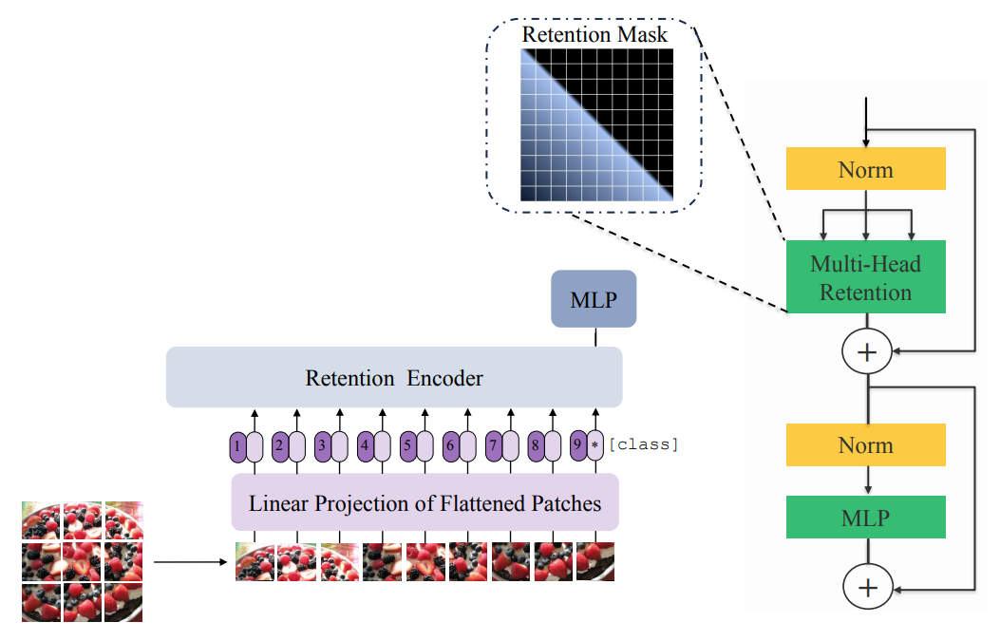

# ViR: Towards Efficient Vision Retention Backbones

Official PyTorch implementation of [**ViR: Towards Efficient Vision Retention Backbones**](https://drive.google.com/file/d/1ny96c7E234dZvbdz-5BbCBEie1zWsBbj/view?usp=sharing).

**Code and pretrained ViR models will be released soon !**  

Vision Transformers (ViTs) have attracted a lot of popularity in recent years, due to their exceptional capabilities in modeling long-range spatial dependencies and scalability for large scale training. Although the training parallelism of self-attention mechanism plays an important role in retaining great performance, its quadratic complexity baffles the application of ViTs in many scenarios which demand fast inference. This effect is even more pronounced in applications in which autoregressive modeling of input features is required. In Natural Language Processing (NLP), a new stream of efforts has proposed parallelizable models with recurrent formulation that allows for efficient inference in generative applications. Inspired by this trend, we propose a new class of computer vision models, dubbed Vision Retention Networks (ViR), with dual parallel and recurrent formulations, which strike an optimal balance between fast inference and parallel training with competitive performance. In particular, ViR scales favorably for image throughput and memory consumption in tasks that require higher-resolution images due to its flexible formulation in processing large sequence lengths. The ViR is the first attempt to realize dual parallel and recurrent equivalency in a general vision backbone for recognition tasks. We have validated the effectiveness of ViR through extensive experiments with different dataset sizes and various image resolutions and achieved competitive performance.

